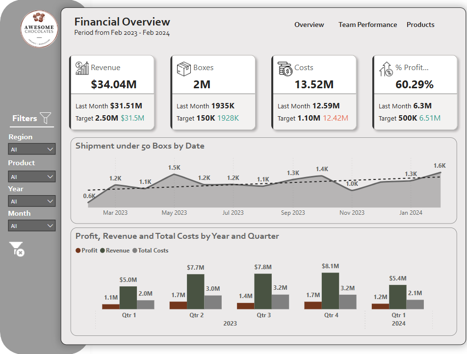
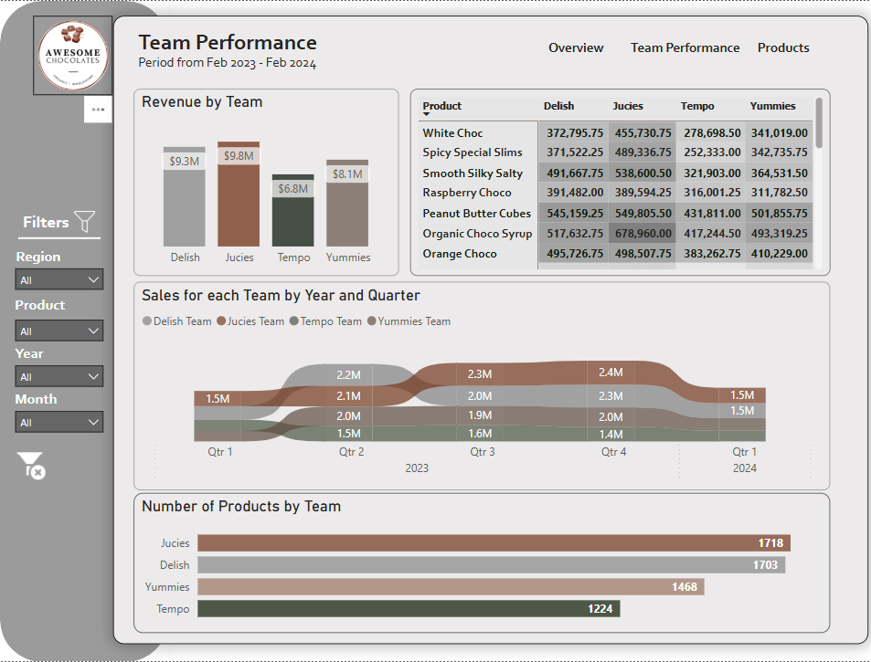
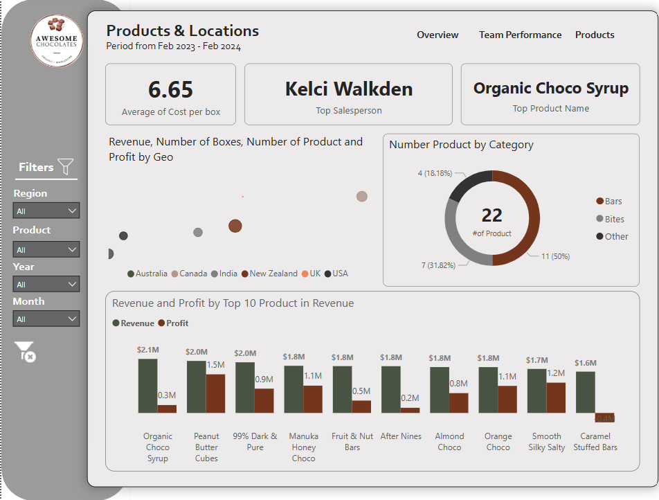

# 📊 Business Performance Dashboard & Report (Feb 2023 – Feb 2024)

This repository provides a comprehensive overview of business performance using both a **Power BI dashboard** and a **PowerPoint summary presentation**. The data spans from February 2023 to February 2024.

---

## 📁 Contents

- `ppt_day4.pptx`  
  A branded PowerPoint presentation with visuals and stakeholder-focused insights.

- `day4.pbix`  
  The Power BI dashboard file containing interactive visual panels and metrics.

- `dashboard_screenshot.png`  
- `dashboard_screenshot2.png`  
- `dashboard_screenshot3.png`  
  Three separate screenshots representing each panel of the Power BI dashboard.

---

## 🔍 Overview

This project offers a detailed view of:

- 💰 Financial Performance  
- 👥 Team Productivity & Product Sales  
- 🌍 Regional and Category Analysis  
- ✅ Strategic Recommendations

---

## 🛠️ Tools Used

- **Power BI (.pbix)** – Interactive data analytics and visualizations  
- **Python (`python-pptx`)** – Automated PowerPoint generation  
- **Microsoft PowerPoint** – Presentation formatting and customization

---

## 🧠 Key Insights

- **Total Revenue:** $34.04M  
- **Profit Margin:** 60.29%  
- **Top Product:** Organic Choco Syrup  
- **Leading Team:** Juicies  
- **Top Sales Performer:** Kelci Walkden

---

## 📊 Dashboard Panels

| Panel 1 | Panel 2 | Panel 3 |
|--------|---------|---------|
|  |  |  |

Each panel represents a different area of business operations, including revenue trends, team metrics, and product breakdowns.

---

## 📌 How to Use

1. **PowerPoint:** Download and present `Business_Performance_Summary_Enhanced.pptx` for executive stakeholders.  
2. **Power BI:** Open the `.pbix` file in Power BI Desktop to explore data interactively.  
3. **Screenshots:** Use panel images for quick reference or visual embedding in reports.

---

## 📬 Contact

For collaboration or questions, feel free to open an issue or reach out directly!

